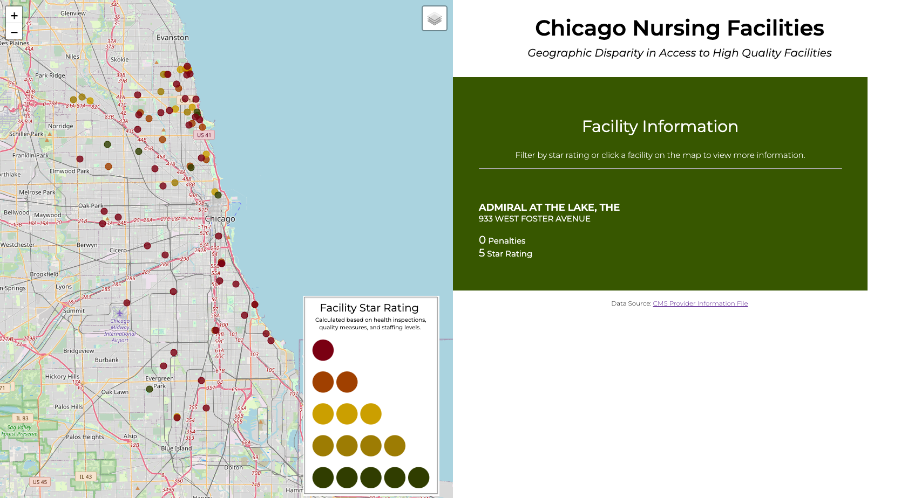

# Chicago Nursing Facilities Map
### Nadia Ghazali
This repository uses Leaflet, D3, CSS, and HTML to generate a site with an interactive map of nursing facilities in Chicago. As you can see, medium and high quality nursing homes are concentrated in the north, while poor quality nursing homes are the only option in the south. Nursing homes are colored based on their facility quality star rating, which users can filter by using the filter icon in the top right of the map. Clicking on facilities gives more information about their name, address, number of penalties, and star rating. 

### Data Sources: 
[CMS Provider Information File](https://data.cms.gov/provider-data/dataset/4pq5-n9py)